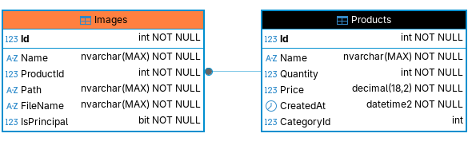
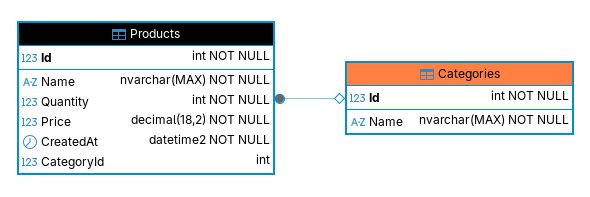
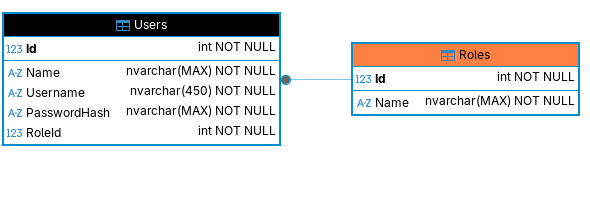

# Desarrollo de un Catalogo de Productos en la web con ASP.NET Core y SQL server

Los requeremientos iniciales fueros:

- Crear productos,
- Modificar los productos ya existentes,
- Cargar sus respectivas imágenes,
- Definir su categoría (Categorizarlos),
- Listarlos por categorías y
- Las categorías también deben ser configurables.

- Las características de los productos deben ser: Nombre, Cantidad, Precio, Fecha de creación
- La página debe contar con una página de inicio (Login y Password) para poder acceder
- Debe existir un módulo que permita administrar las categorías
- las categorías son específicas y no son hashtag o similar

para dicho proyecto se decide usar la arquitectura Model-View-Controller, porque me permite separar las responsabilidades de las entidades que operan a nivel de los daots, la vista o capa de presentacion con el que se interactua y el manejo de solicitudes, tambien porque considero que el patron me da la estrcutura para prototipar sistemas e incluso poder escalar a requerimientos mas avanzados, por lo tanto se ajusta perfecto a las operaciones que se puedan realizar sobre productos en un catalogo con imagenes y categorias

dicho esto lo primero que realice fue identificar las reglas que el sistema debe contener y manejar:

---

## Producto:

-> creacion de productos: se debe permitir crear un producto con las propiedades Nombre, Cantidad, Precio y Fecha de creacion  

-> relacion con categorias: a parte de las propiedades del producto como entidad, se añade una para definir su relacion con la entidad de Categoria, esta relacion segun los requerimientos es especifica por lo tanto el diseño mas optimo es que un Producto solo puede tener una Categoria que lo define (1-1)  

-> imagenes: segun el requerimiento se debe permitir la carga de imagenes para los productos, el diseño que plantee fue que un producto puede tener varias imagenes, y ademas considere como detalle que se pueda seleccionar una imagen como la imagen que represente el producto por defecto y que el usuario tenga la opcion de seleccionar que imagen es la principal (dos imagenes no pueden ser la principal de su mismo producto)  

-> listar productos: defini que la vista principal con la que un usuario se encuentre es el listado de los productos con informacion principal, aqui el usuario solamente puede ver la imagen principal de cada producto, si quiere ver el detalle del producto y las otras imagenes que pueda tener, debera seleccionar la opcion ver, ademas tambien contara con la opcion que lo dirije a poder editar el producto, la opcion para crear un nuevo producto y una barra de opciones donde podra realizar busqueda avanzada por los siguientes items: (nombre, cantidad desde y hasta, precio desde y hasta, fecha de creacion desde y hasta, selector multiple de categorias)  

*Nota: al momento de redactar esta especificacion observe que se pudo haber tenido una opcion para limitar el resultado de productos en la tabla, lo pude haber realizado sencillamente con paginacion del tipo offset*

-> ver detalle de producto: en el detalle del producto se encuentra las propiedades y las demas imagenes que se le hayan cargado  

-> editar: se permite editar un producto en especifico, las propiedades deben ser acorde a las validaciones de los tipos de datos de cada propiedad, es decir no se aceptan valores vacios, del tipo erroneo y minimo debe existir una imagen del producto, tambien se puede cambiar cual es la imagen que representara al producto principalmente  

---

## Imagen:

para cumplir con la idea de que un producto tenga varias imagenes, se decidio por diseño separar como entidad "Imagen" a cada elemento que pertenezca a un producto  

solo una de ellas podra ser la imagen principal y esta logica se define en la implementacion  

---

## Categoria:

para esta entidad me tome la libertad de diseño de que cumpliera con la regla de que un usuario del tipo administrador o con rol administrador, solo pueda editar o crear nuevas categorias, esto basado en la premisa de que en este tipo de sistemas de catalogos web, los usuarios administradores son los que gestionan el contenido base de las webs, asi que me parecion preciso la inclusion de dicha regla, a parte que puedo mostrar un ejemplo de como se protegen ciertas rutas basado en permisos con roles  

dicho eso defini que:

-> creacion: solo un usuario del tipo admin puede crear categorias  

-> listado: solo un usuario del tipo admin puede listar las categorias para su administracion (cumpliendo con el requerimiento de modulo de administracion de categorias)  

-> eliminacion: solo un usuario del tipo admin puede eliminar una categoria, cuando se seleciona la opcion, el sistema lanzara un aviso de que se eliminara dicha categoria y la cantidad de productos que tienen dicha categoria  

-> eliminacion para productos: cuando una categoria es eliminada del sistema, todos los productos con dicha categoria pasaran a no poseer una categoria especifica, hasta que se les reasigne otra y estos a su vez tendran implicitamente la categoria "sin categoria" con la cual se podra ubicar dichos productos para su futura referenciacion  

-> edicion: solo un usuario del tipo admin puede editar la categoria esta por estar relacionada con un Id, los productos no se preocupan por dichas actualizaciones  

---

## Usuario:

para dar cumplimiento al requerimiento de que se debe contar con un sistema de login con usuario y contraseña, me parecion necesario diseñar la entidad que represente a un usuario para su identificacion y autorizacion(para modulos), dicho esto considere que tambien era necesario una entidad "Rol" que represente que rol cumplia el usuario dentro del sistema que me permitiera identificar los modulos a los que pudiera realizar peticiones  

*Nota: si bien parece demasiada separacion de entidades, en el momento de que querramos mas roles, mas modulos y mas reglas, la entidad rol ya existira alli para soportar los cambios en el diseño del sistema*

->creacion: un usuario puede registrarse, se decidio esta accion para simular un entorno mas real, aqui valido el campo que seleccione como unico para un posible indice de busqueda o identificacion si es que el sistema asi lo quiera escalar  

->super usuarios: por defecto inclui un solo usuario administrador con el username `admin` y la contraseña `root777` esto con motivos de alimentacion de datos iniciales de la base de datos  

---

con las reglas claras de la primera version de funcionalidades que debe realizar nuestro sistema, procedo a diseñar el modelo relacional de base de datos.
---



---
# Ambiente

una vez el diseño realizado, paso a organizar el ambiente de trabajo el cual consiste en:
- ASP.NET Core 9 MVC web app
- image: mcr.microsoft.com/mssql/server:2022-latest (imagen docker para sql server)
- control de versiones git y repositorio github
- plataforma de desarrollo Linux Fedora 42 (compatibilidad con el SDK NET 9)

Dependencias Nuget:
EntityFrameworkCore
EntityFrameworkCore.SqlServer
EntityFrameworkCore.Tools (para migraciones)

### **variables de entorno**

para que se pueda establecer la cadena de conexion que requiere la imagen sqlserver de Docker, es necesario que cree un archivo `.env` al nivel donde se encuentre el archivo `.yaml` del composer

una vez tenga todo configurado deberia proceder a levantar docker

```
docker compose up -d sqlserver
```

crear el usuario para la app

```shell
docker exec -it webapp \  
/opt/mssql-tools18/bin/sqlcmd \  
-S localhost \  
-U SA \  
-P "S3cr10eTt00oSt8n" -C
```

creamos el usuario para la aplicacion

```
CREATE DATABASE AppDb;  
GO  
  
CREATE LOGIN app_user WITH PASSWORD = 'AppP@ssw0rd';  
GO  
  
USE AppDb;  
GO  
  
CREATE USER app_user FOR LOGIN app_user;  
GO  
  
ALTER ROLE db_owner ADD MEMBER app_user;  
GO
```


En sistemas Linux puede realizar las migraciones con la herramienta global ef, personalmente uso --global para poder acceder en la terminal en cualquier caso

```
dotnet ef migrations add CreateUsers
dotnet ef database update
```

# Arquitectura MVC y Desarrollo

*Espero poder comunicar de manera verbal el desarrollo y decisiones de diseño*
